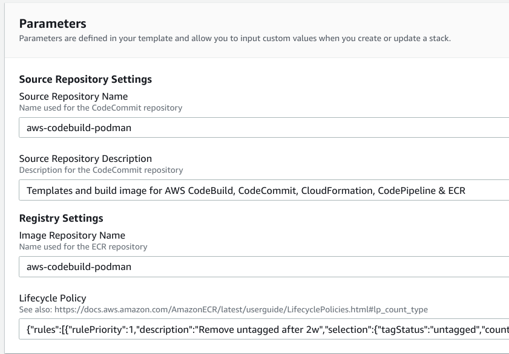
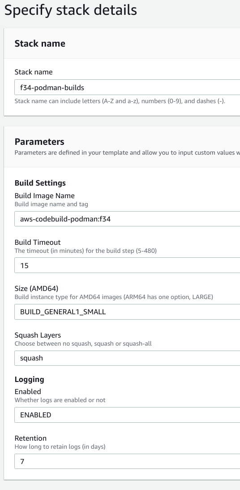
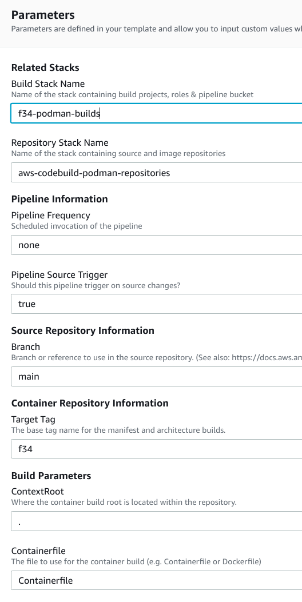
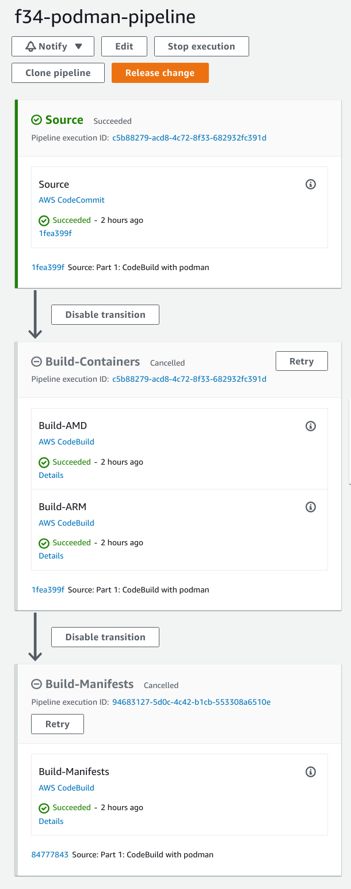
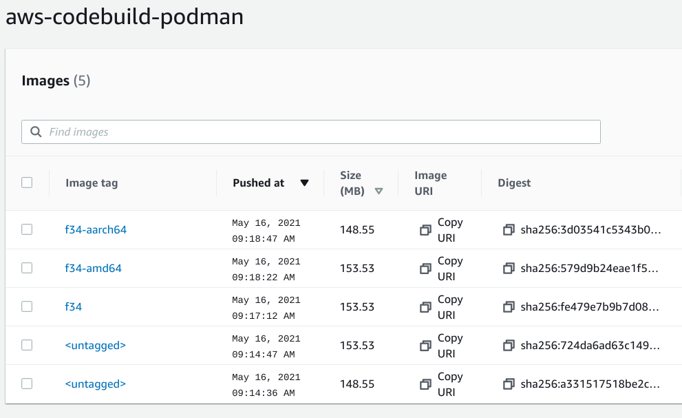

# Using podman with AWS CodeBuild

[AWS CodeBuild][codebuild] provides a managed, batch build environment.
In addition, CodeBuild integrates with many other AWS services such as 
[CodePipeline][codepipeline], [ECR][ecr], [CodeCommit][codecommit] to 
allow organized build environments.

By default, it [provides numerous environments][codebuild-envs], including docker.
However, the version of docker provided is somewhat dated and out of your control.
You can provide [custom build environments][codebuild-custom] to get newer versions
and customize the config.
If we're going to do that, we might as well use [podman].

This repository provides the templates and descriptions needed to provision code
repositories, container image repositories, and the build jobs + pipelines needed to
use podman in AWS CodeBuild.

## Capabilities

- [x] Create all required resources with [CloudFormation][cloudformation]
- [x] Build multi-arch containers with CodeBuild and CodePipeline using podman
- [x] Allow squashing image layers
- [x] Pipelines triggered periodically and on source code changes
- [x] Support S2I builders
- [x] Support FROM replacement & image triggers with private ECR repositories
- [x] Support operator builds with [Operator SDK](https://sdk.operatorframework.io/)
- [x] Support external repositories (Github, Bitbucket)

## Pre-requisites
- An AWS Account
- IAM user
- CodeCommit credentials [configured](https://docs.aws.amazon.com/IAM/latest/UserGuide/id_credentials_ssh-keys.html)
- [AWS CLI installed and configured](https://docs.aws.amazon.com/cli/latest/userguide/cli-chap-install.html)

## Costs
AWS costs are charged by resource usage and time. These stacks will provide a best-effort
tear down of the resources consumed when stacks are deleted. To help identify items 
in your account which may lead to items on your bill, here is a helpful checklist:

- [CloudWatch pricing][cloudwatch-pricing]
- [CodeBuild pricing][codebuild-pricing]
- [CodeCommit pricing][codecommit-pricing]
- [CodePipeline pricing][codepipeline-pricing]
- [ECR pricing][ecr-pricing]

## Setting up
Each container to be built with our CodeBuild projects and pipeline will need both a source and 
image repository.
To illustrate this process, we will use the same mechanisms for the build image we will 
use to build all the others.

### Creating the repositories for your container source and build image
Using [01_repositories.yaml](cloudformation/01_repositories.yaml) and CloudFormation, 
we will [create a new stack][cloudformation-create-stack].
This will create the CodeCommit source repository and Elastic Container Registry (ECR)
image repository in AWS.

*Note:* This template can be used repeatedly for every source and container repository needed.

**Example:**

In this example, we'll create a git repository for this clone in CodeCommit and also
an ECR image repository for the build image.
In addition, this template has the ability to specify lifecycle policies for the ECR repository.
The default is to expire untagged images after 2 weeks. We'll leave that alone, but more complicated
policies are possible.



TBD: Picture of the CodeCommit repository

TBD: Picture of the ECR repository 

### Cloning the git repository
Once that stack completes creation successfully, we now have a source repository to store
this repository clone. See the [CodeCommit Getting Started][codecommit-getting-started] 
for how to configure your credentials and populate your repository.

**Example:**
Here's an example from my local Fedora 34 workstation

```bash
$ git clone https://github.com/cuppett/aws-codebuild-podman.git
$ cd aws-codebuild-podman
$ git remote add downstream ssh://APKAZZZZZALIKFMQWN@git-codecommit.us-east-1.amazonaws.com/v1/repos/aws-codebuild-podman
$ sudo update-crypto-policies --set DEFAULT:FEDORA32
$ git push downstream main
```

### Bootstrapping the initial multi-arch container builds
Using Fedora workstation, it is possible to build the first couple container images required to 
initially hydrate your build environment

#### Install qemu-user-static
```bash
$ sudo dnf -y install qemu-user-static
```

#### Build the two architecture images
Depending on the architecture of your system, one of these commands will take much longer (due to the emulation).
```bash
$ podman build --squash --manifest aws-codebuild-podman --arch amd64 -f Containerfile ./
$ podman build --squash --manifest aws-codebuild-podman --arch arm64 -f Containerfile ./
```

#### Logging into ECR and pushing container manifest + images
```bash
$ aws ecr --profile cuppett --region us-east-1 get-login-password \
 | podman login -u AWS --password-stdin 123456789.dkr.ecr.us-east-1.amazonaws.com
Login Succeeded!
```

For my public tag, I’m going to use “f35” to represent Fedora 35. 
We could also use “latest” here or “main” to represent the branch; 
however, I want to be explicit which distribution and version is underneath 
and how that may correspond to the things in the Containerfile or any other 
idiosyncrasies observed or recorded in the logs.

```bash
$ podman manifest push aws-codebuild-podman \
  123456789.dkr.ecr.us-east-1.amazonaws.com/aws-codebuild-podman:f35
```
Upon successful completion of this command, the image is now available in AWS, and we can 
begin creating pipelines and referencing this image in build jobs.

TBD: Picture of the ECR images from the initial push

## Creating the Build Jobs
A shared set of CodeBuild build projects, S3 bucket, and IAM roles are provisioned via
[02_codebuild_projects.yaml](cloudformation/02_codebuild_projects.yaml).
This file is versioned in the branch to capture the various idiosyncrasies of running the
version of Fedora and podman on the AWS CodeBuild kernel.
Those elements are captured both in the [Containerfile](Containerfile) and also the
[buildspec][codebuild-buildspec] encoded in the CloudFormation stack template.

As of this writing here are the versions used/observed in this project:

* Fedora: 36
* Podman: 4.1.0 go1.18
* CodeBuild kernel: 4.14.246-187.474.amzn2.x86_64

Once again, you will create a new CloudFormation stack this time using the 
02_codebuild_projects.yaml template.
You can also use this template multiple times; however, it should only be necessary
when experimenting with different build images (e.g. newer images of Fedora, podman or
changes to the buildspec.yaml in the template).
The resources created here have the needed permissions for all CodeCommit repositories,
shared logging, a pipeline bucket and any/all ECR image repositories.

**Example:**
Here's an example referencing the aws-codebuild-podman:f34 image we uploaded



TBD: Picture of the Build Projects

## Creating the Pipeline
A shared set of CodePipeline steps and the pipeline itself are codified in
[03_codepipeline_containers.yaml](cloudformation/03_codepipeline_containers.yaml)
or [03_codepipeline_operators.yaml](cloudformation/03_codepipeline_operators.yaml).
This file is versioned in the branch to set the parameters required for the
CodeBuild projects defined in the lower stack.
To create a pipeline and this stack, you will reference the unique repository
names, the branch/tags to use and the shared CodeBuild project stack to complete
the picture.

**Example:**
Here's an example referencing the two stacks we've created:



Once you've successfully created the stack, the pipeline begins to execute immediately.
Using the CodePipeline console, you can observe the pipeline steps and overall execution.
Upon completion you should see a screen similar to the following: 



Also, in the ECR console, you should be able to see the previously submitted images and
the newly tagged ones (for both architectures):



## Creating "The Next One"

### Separate repository/project

For additional image builds using a repository, you only need to create more of the
following two stacks:

1. [01_repositories.yaml](cloudformation/01_repositories.yaml)
2. [03_codepipeline_containers.yaml](cloudformation/03_codepipeline_containers.yaml) or
   [03_codepipeline_operators.yaml](cloudformation/03_codepipeline_operators.yaml)

In #1, you'll create unique names for the repositories. In #3, you'll reference the shared
build stacks again, and the unique repositories stack from #1.

### Same repository, different branch or tag

For additional image builds using the same repository, you only need to create a separate
pipeline stack, [03_codepipeline_containers.yaml](cloudformation/03_codepipeline_containers.yaml) or
[03_codepipeline_operators.yaml](cloudformation/03_codepipeline_operators.yaml).

In the stack, you'll reference the same repository stack and the shared
build stacks.

[cloudformation]: https://aws.amazon.com/cloudformation/
[cloudformation-create-stack]: https://docs.aws.amazon.com/AWSCloudFormation/latest/UserGuide/cfn-console-create-stack.html
[cloudwatch-pricing]: https://aws.amazon.com/cloudwatch/pricing/
[codebuild]: https://aws.amazon.com/codebuild/
[codebuild-buildspec]: https://docs.aws.amazon.com/codebuild/latest/userguide/build-spec-ref.html
[codebuild-custom]: https://aws.amazon.com/blogs/devops/extending-aws-codebuild-with-custom-build-environments/
[codebuild-envs]: https://docs.aws.amazon.com/codebuild/latest/userguide/build-env-ref.html
[codebuild-pricing]: https://aws.amazon.com/codebuild/pricing/
[codecommit]: https://aws.amazon.com/codecommit/
[codecommit-getting-started]: https://docs.aws.amazon.com/codecommit/latest/userguide/getting-started.html
[codecommit-pricing]: https://aws.amazon.com/codecommit/pricing/
[codepipeline]: https://aws.amazon.com/codepipeline/
[codepipeline-pricing]: https://aws.amazon.com/codepipeline/pricing/
[ecr]: https://aws.amazon.com/ecr/
[ecr-pricing]: https://aws.amazon.com/ecr/pricing/
[podman]: https://podman.io/
